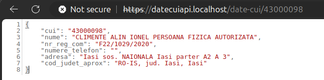

# DATE CUI API

Un api simplu in Go pentru a prelua date firme in functie de CUI. 

- `go run main.go` - pentru a rula API-ul;
- Un GET request la adresa url `http://localhost:3240/date-cui/43000098` va da un raspuns similar:
```json
{
    "cui": "43000098",
    "nume": "CLIMENTE ALIN IONEL PERSOANA FIZICA AUTORIZATA",
    "nr_reg_com": "F22/1029/2020",
    "numere_telefon": "",
    "adresa": "Iasi",
    "cod_judet_aprox": "RO-IS, jud. Iasi, Iasi"
}
```

**Observatii**: 
- Setul de date oferit din iunie_2024 are toate diacriticele lipsa, asa ca sunt multe adrese gresite.

Datele sunt publice si oferite de [data.gov.ro](https://data.gov.ro/dataset/) la adresa web:
- https://data.gov.ro/dataset/date_de_identificare_platitori_actualizate_iunie_2024


Poti vedea date CUI si la pagina web oferita de Ministerul Finantelor:
- https://mfinante.gov.ro/apps/agenticod.html?pagina=domenii


In docker: 
- `docker-compose up -d` url disponibil la:  `https://datecuiapi.localhost/date-cui/{cui}`; 


- Vei avea nevoie si de `date_firme_cui.db` - 200 RON la cerere (~2mil firme si pfa-uri);

Fisierul binary este in folderul dist si a fost creat cu comanda: `go build -o dist/datecuiapi main.go`.
